# 👩 Gender Verification Setup Guide

## Overview

Pad-Mini now includes **AI-powered gender verification** to ensure the platform remains exclusive to female college students. This maintains a safe, trusted community.

---

## 🎯 How It Works

```mermaid
sequenceDiagram
    participant User
    participant App
    participant Camera
    participant AI as Face++ API
    participant Firestore

    User->>App: Complete registration
    App->>Camera: Request camera access
    Camera-->>User: Show camera view
    User->>Camera: Position face in frame
    Camera->>App: Face detected ✓
    User->>App: Click "Verify Identity"
    App->>Camera: Capture photo
    Camera-->>App: Photo + base64
    App->>AI: Analyze gender (photo)
    AI-->>App: Result (Female, 95% confidence)
    alt Female + High Confidence
        App->>Firestore: Mark verified = true
        App->>User: ✓ Welcome! Navigate to Home
    else Female + Low Confidence
        App->>Firestore: Mark pendingReview = true
        App->>User: ⏳ Manual review required
    else Not Female
        App->>User: 🚫 Access denied (female-only platform)
    end
```



---

## 🔧 Setup Instructions

### **Step 1: Get Face++ API Credentials (Recommended)**

Face++ offers **free tier** with 1,000 API calls/month - perfect for small to medium apps.

1. **Sign up for Face++:**
   ```
   https://console.faceplusplus.com/register
   ```

2. **Get API Credentials:**
   - After signup, go to Dashboard
   - Copy your **API Key** and **API Secret**

3. **Update Configuration:**
   Edit `src/services/GenderVerificationService.js`:
   ```javascript
   const FACE_API_CONFIG = {
     facePlusPlus: {
       apiKey: 'YOUR_API_KEY_HERE',        // ← Paste your API key
       apiSecret: 'YOUR_API_SECRET_HERE',   // ← Paste your API secret
       endpoint: 'https://api-us.faceplusplus.com/facepp/v3/detect'
     },
     femaleConfidenceThreshold: 70,  // Adjust as needed (50-95)
     allowManualReview: true
   };
   ```

---

### **Step 2: Install Required Dependencies**

The camera and face detection packages should already be installed, but verify:

```bash
npm install expo-camera expo-face-detector
```

---

### **Step 3: Test Gender Verification**

1. **Start your app:**
   ```bash
   npm start
   # Press 'w' for web browser
   ```

2. **Register a new female user:**
   - Use a test email (e.g., `female.test@bit-bangalore.edu.in`)
   - Complete OTP step

3. **On Verification Screen:**
   - Grant camera permission
   - Position face in frame
   - Click "Verify Identity"
   - Wait for analysis (~2-5 seconds)

4. **Expected Results:**
   - ✅ **Female detected (high confidence)** → Proceed to Home
   - ⏳ **Female detected (low confidence)** → Pending manual review
   - 🚫 **Male detected** → Access denied with message

---

## 📊 Verification Results Explained

### **✅ Verification Successful (Female, High Confidence)**

```
Gender: Female
Confidence: 85%+
Face Quality: Good

Result: Account verified immediately
User can access all app features
```

### **⏳ Manual Review Required (Female, Low Confidence)**

```
Gender: Female
Confidence: 50-70%
Face Quality: Good/Fair

Result: Pending admin review
User receives email when approved (24h)
```

### **🚫 Access Denied (Not Female)**

```
Gender: Male
Confidence: 70%+

Result: Access permanently denied
User redirected to Welcome screen
Clear message: "Female-only platform"
```

### **⚠️ Quality Issues**

```
Face Quality: < 70
or No face detected
or Multiple faces

Result: Retry requested
User can retake photo
```

---

## 🎛️ Configuration Options

### **Adjust Confidence Threshold**

In `GenderVerificationService.js`:

```javascript
femaleConfidenceThreshold: 70  // Default: 70%

// Options:
// - 50-60: More permissive (more manual reviews)
// - 70-80: Balanced (recommended)
// - 85-95: Strict (fewer false positives, more rejections)
```

### **Enable/Disable Manual Review**

```javascript
allowManualReview: true  // Default: true

// true:  Borderline cases go to admin review
// false: Borderline cases are rejected immediately
```

---

## 🔐 Security & Privacy

### **Data Handling**
- ✅ Photos sent via HTTPS to Face++ API
- ✅ Face++ does not store images permanently
- ✅ Only gender metadata stored in Firestore
- ✅ Original photo NOT saved (privacy-first)

### **Firestore Schema**

```javascript
users/{uid} {
  verified: true/false,
  verificationDate: timestamp,
  verificationMethod: 'face_gender_detection',
  gender: 'Female',
  genderConfidence: 85.5,
  faceQuality: 92.3,
  pendingReview: false  // true if needs manual review
}
```

---

## 🧪 Testing Bypass (Development Only)

For testing **without real face detection**, the bypass button is still available:

**VerificationScreen:**
- Click **"Skip Verification (Testing)"**
- Confirms dialog
- Marks account as `verificationMethod: 'bypassed_for_testing'`

⚠️ **Remove this button before production!**

---

## 🚀 Production Deployment Checklist

Before going live:

- [ ] Add real Face++ API credentials
- [ ] Set appropriate confidence threshold (70-80%)
- [ ] Test with multiple female users
- [ ] Test edge cases (low light, glasses, etc.)
- [ ] Remove or hide bypass button (`{__DEV__ && ...}`)
- [ ] Set up admin panel for manual reviews
- [ ] Add Firestore security rules:
  ```javascript
  match /users/{userId} {
    allow update: if request.auth.uid == userId 
                  && request.resource.data.verified == false;
    // Only admins can mark as verified
  }
  ```
- [ ] Monitor Face++ API usage (1000/month free tier)
- [ ] Set up rate limiting to prevent abuse

---

## 📈 API Usage & Costs

### **Face++ Free Tier**
- **1,000 API calls/month** - FREE
- **0.001 second/call** - Very fast
- **Attributes included:** Gender, age, face quality, etc.

### **Usage Estimation**
```
New registrations/day × 30 = Monthly calls

Example:
- 20 registrations/day = 600 calls/month ✅ FREE
- 50 registrations/day = 1,500 calls/month → Need paid tier
```

### **Paid Tiers (if needed)**
- **2,000 calls/month:** $0.30
- **10,000 calls/month:** $1.50
- **50,000 calls/month:** $7.50

Very affordable for growth! 🚀

---

## 🐛 Troubleshooting

### **"Failed to analyze face" Error**

1. **Check API credentials** in `GenderVerificationService.js`
2. **Verify internet connection**
3. **Check Face++ API status:** https://status.faceplusplus.com/
4. **Review console logs** for detailed error messages

### **"No face detected" Message**

- Ensure good lighting
- Center face in frame
- Remove sunglasses/masks
- Keep phone steady

### **Low Confidence Results**

- Retake photo in better lighting
- Face camera directly (not at angle)
- Clear background
- Adjust `femaleConfidenceThreshold` if too strict

---

## 🔄 Alternative: Client-Side Detection (Privacy-Focused)

If you prefer **not to send photos** to external APIs:

### **Use face-api.js (TensorFlow.js)**

1. **Install:**
   ```bash
   npm install face-api.js @tensorflow/tfjs-react-native
   ```

2. **Update config:**
   ```javascript
   useFaceApiJs: true  // In GenderVerificationService.js
   ```

3. **Load models** in `App.js`:
   ```javascript
   import * as faceapi from 'face-api.js';
   
   await faceapi.nets.tinyFaceDetector.loadFromUri('/models');
   await faceapi.nets.ageGenderNet.loadFromUri('/models');
   ```

**Trade-offs:**
- ✅ Complete privacy (no external API)
- ✅ No API costs
- ✅ Works offline
- ⚠️ Less accurate than Face++
- ⚠️ Larger app size (model files ~10MB)
- ⚠️ Slower on older devices

---

## 📞 Support

**Face++ Documentation:** https://console.faceplusplus.com/documents/  
**face-api.js:** https://github.com/justadudewhohacks/face-api.js

**Questions?** Check the implementation in:
- `/src/services/GenderVerificationService.js`
- `/src/screens/VerificationScreen.js`

---

## ✅ Success Criteria

Your gender verification is working correctly when:

- ✅ Female users with clear photos are verified immediately
- ✅ Borderline cases go to manual review (if enabled)
- ✅ Male users receive clear "access denied" message
- ✅ Low-quality photos trigger retake requests
- ✅ Firestore correctly stores verification metadata
- ✅ No false positives (males getting through)
- ✅ Acceptable false negative rate (females being rejected)

**Target Accuracy:** 95%+ with properly lit photos

---

**Your platform is now protected with AI-powered gender verification! 🎉**
