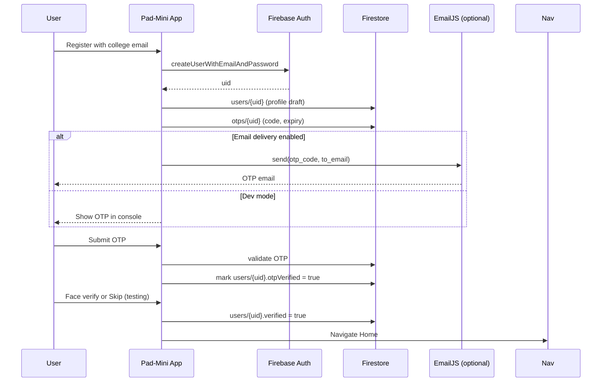
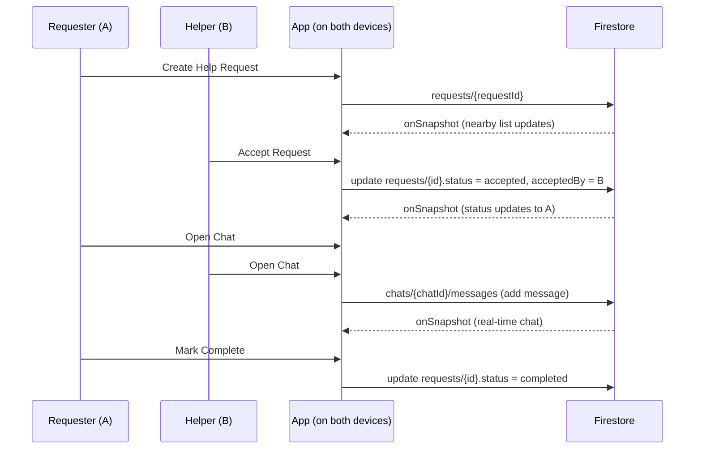
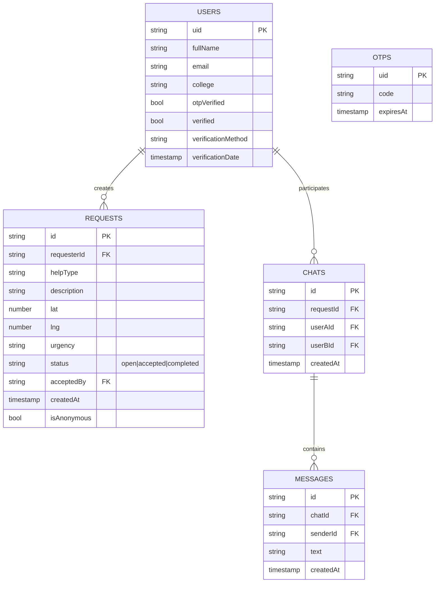

# Pad-Mini Architecture

This document provides a high-level view of the Pad-Mini app architecture, the main data flows, and how the codebase maps to the architecture.

---

## 🏗️ System Overview

```mermaid
flowchart LR
  subgraph Client[React Native App (Expo)]
    UI[React Native + React Native Paper]
    Nav[React Navigation]
    Ctx[Auth Context]
    Svc[Services Layer]
  end

  subgraph Firebase[Firebase Backend]
    Auth[Auth (Email/Password)]
    FS[(Firestore)]
    Storage[Storage]
    FCM[Cloud Messaging]
  end

  subgraph Integrations[External Services]
    EmailJS[EmailJS (OTP Email Delivery)]
    ExpoAPIs[Expo APIs (Camera, Location)]
  end

  UI --> Nav
  UI --> Ctx
  Ctx --> Svc
  Svc --> Auth
  Svc --> FS
  Svc --> Storage
  Svc --> FCM
  Svc -. optional .-> EmailJS
  UI --> ExpoAPIs
```

- Client app built with React Native (Expo) uses a Services layer to interact with Firebase.
- Firestore onSnapshot listeners provide real-time updates (requests, chats, statuses).
- EmailJS is optional for OTP email delivery (console OTP for dev).
- Expo APIs provide Camera (face detection), Location, etc.

---

## 🧭 Primary Flows

### 1) Registration + OTP + Verification



### 2) Help Request → Accept → Chat



---

## 🗃️ Firestore Data Model (Simplified)



---

## 📁 Code Map

- `App.js` / `src/index.js` – App bootstrap, navigation root
- `src/context/AuthContext.js` – Auth state, user profile, verification updates
- `src/services/AuthService.js` – Firebase Auth, OTP create/verify
- `src/services/RequestService.js` – Requests CRUD + listeners
- `src/services/ChatService.js` – Chats + messages listeners
- `src/screens/WelcomeScreen.js` – Landing + Sign-in dialog
- `src/screens/OTPRegisterScreen.js` – Registration + OTP steps
- `src/screens/VerificationScreen.js` – Face verify + testing bypass
- `src/screens/HomeScreen.js` – Feed, active requests, stats
- `src/screens/RequestHelpScreen.js` – Create help request
- `src/screens/HelpResponseScreen.js` – Accept/help flow
- `src/screens/ChatScreen.js` – Real-time chat (Gifted Chat)
- `src/config/firebase.js` – Firebase config/init
- `src/config/emailjs.js` – EmailJS config (optional)
- `src/theme/theme.js` – Material theme

---

## 🔄 Real-Time Listeners

- Nearby Requests: `RequestService.getNearbyRequests(..., onSnapshotCb)`
- My Requests: `RequestService.getUserRequests(..., onSnapshotCb)`
- Chat Messages: `ChatService.subscribeToMessages(chatId, onSnapshotCb)`
- Notifications: `NotificationService` (placeholder / extendable)

---

## 🔐 Security & Privacy

- College domain validation (e.g., `@bit-bangalore.edu.in`)
- OTP verification before activation
- Face verification step or explicit dev bypass
- Anonymous request option
- Encrypted chat with auto-deletion policy (24h)
- Firestore rules restrict access by user and college

---

## 🚀 Environments

- Dev: OTP shown in console, verification bypass available
- Prod: EmailJS enabled, camera verification required, stricter rules

---

## 🧭 Next Steps

- Add push notifications (FCM)
- Add proximity-based ranking for matches
- Harden Firestore rules for production
- Add background location permission flow (opt-in)
```
